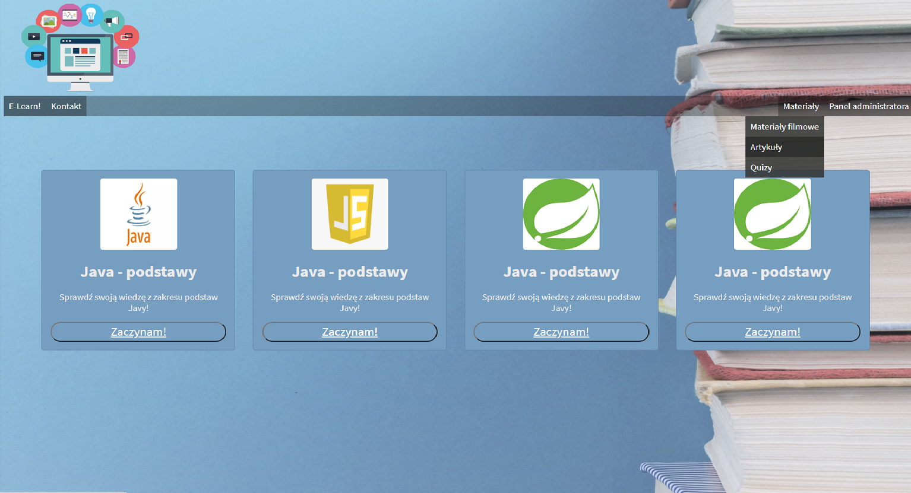

# E-lerning-portal
Web application for company e-learning program. Spring Boot, Spring Security, Maven, Thymeleaf, CSS, HTML, Hibernate Validator, BCrypt, JpaRepository, Postgresql,

## Table of contents
* [General info](#general-info)
* [Screenshots](#screenshots)
* [Technologies](#technologies)
* [Deployment](#deployment)
* [Features](#features)
* [Status](#status)

## General info
The application will be designe to provide an internal solution for corporate use. It will allows you to easily prepare training courses on various topics in the form of articles or videos, and then check the knowledge of the trained person in the form of a quick quiz. At this moment application allow to:
* register user - two roles: USER and ADMIN
* add quiz with categories - admin
* pass quiz - user
* save and display results of user quiz in profile
* send contact form 

## Screenshots

## Technologies
* Spring Boot
* Spring security
* Maven
* Hibernate validator
* JpaRepository
* Postgresql
* BCrypt
* Thymeleaf
* HTML 5
* CSS

## Deployment
Version under construction is deployed on: https://elerning.herokuapp.com/

## Features
* adding videos and articles
* link quiz to videos and articles
* send score to coordinator
* categories manager

To-do list:
* improve layout with css
* implement tests

## Status
Project is: _in progress_
